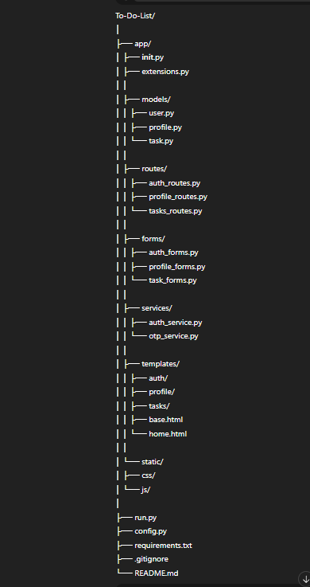
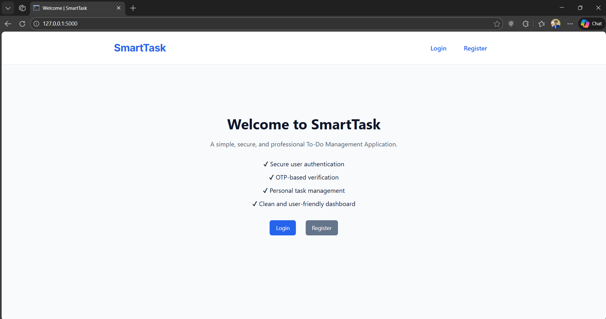
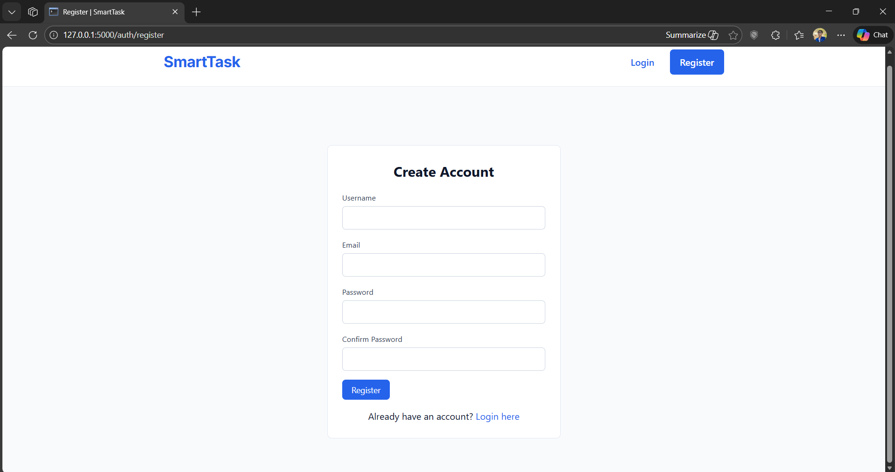
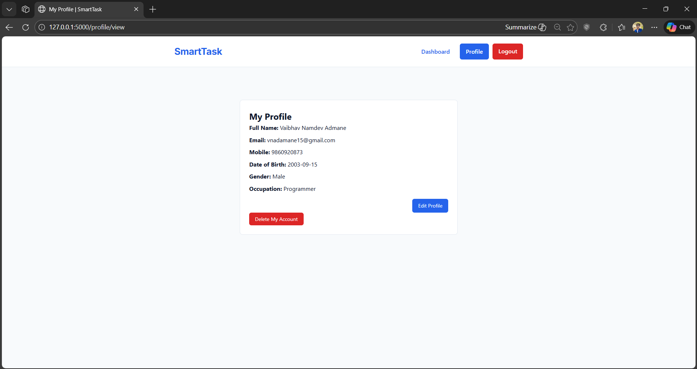
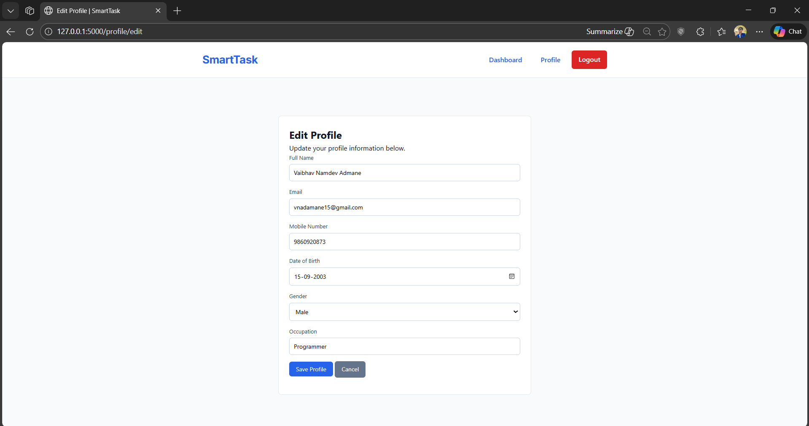
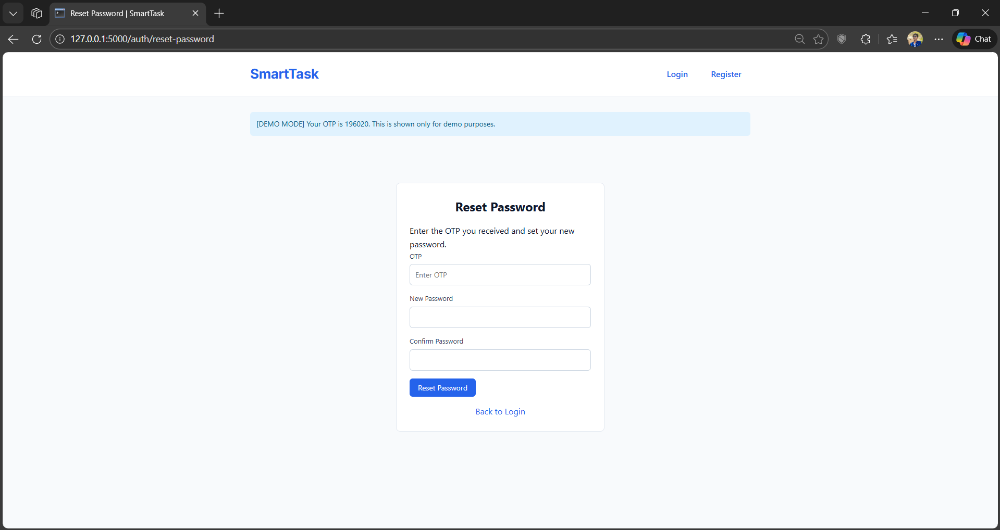

# SmartTask – Full Stack Flask To-Do Application

SmartTask is a professional, multi-user To-Do List web application built using **Flask**.
It demonstrates real-world backend architecture, authentication, OTP verification (demo mode),
profile management, and secure task CRUD operations.

This project is designed to be **deployment-ready and interview-ready**, following standard backend development practices.

---

## 🌐 Live Application
🔗 Deployed on Render  
(Add your Render URL here after deployment)

---

## 🚀 Key Features

### 👤 User Authentication
- User registration with unique username
- Secure login and logout
- Password hashing using Werkzeug
- Session-based authentication
- Forgot password functionality with OTP verification

### 🔐 OTP Verification (Demo Mode)
- OTP generated securely on the server
- OTP stored temporarily in session
- OTP displayed using flash message (demo purpose)
- OTP expires automatically after 5 minutes
- Used for:
  - New user registration
  - Forgot password flow

> ⚠️ Note  
> OTPs are shown via flash messages only for demo and deployment stability.
> The OTP service layer is designed so real Email/SMS services can be plugged in later.

### 🧾 Profile Management
- Mandatory profile creation after registration
- Edit profile functionality
- Validation for email, mobile number, and date of birth
- Profile strictly linked to logged-in user
- User can delete their own account

### ✅ Task Management (CRUD)
- Create new tasks
- View pending and completed tasks
- Edit existing tasks
- Delete tasks
- Toggle task status (Pending ↔ Completed)
- Tasks are accessible only to their respective owners

### 🎨 User Experience
- Responsive UI (mobile, tablet, desktop)
- Clean navigation bar with session awareness
- Flash messages for success and errors
- Auto-hide flash messages with animation
- Double form submission prevention
- Confirmation dialog for destructive actions

---

## 🏗️ Technology Stack

### Backend
- Python
- Flask
- Flask-WTF
- Flask-SQLAlchemy
- Werkzeug
- Gunicorn

### Frontend
- HTML (Jinja2 Templates)
- CSS
- JavaScript

### Database
- SQLite (local and demo deployment)
- ORM: SQLAlchemy

### Deployment
- Render
- GitHub (version control)

---

## 📂 Project Structure

 
---

## ⚙️ Run Locally

1. Clone repository
   git clone https://github.com/your-username/smarttask-flask-app.git

2. Create virtual environment
   python -m venv venv

3. Activate environment
   venv\Scripts\activate  (Windows)

4. Install dependencies
   pip install -r requirements.txt

5. Run application
   python run.py

Open: http://127.0.0.1:5000

---

## 🚀 Deployment (Render)

- Application deployed using Gunicorn
- Environment variables configured via Render dashboard
- No .env file used in production
- SQLite used for demo deployment

Start command:
gunicorn run:app

---

## 🔒 Security Practices
- Password hashing
- Session-based authentication
- Protected routes
- User-specific data filtering
- OTP expiration enforced
- No sensitive data committed to GitHub

---

## 🧠 What This Project Demonstrates
- Real-world Flask application architecture
- Secure authentication and authorization
- OTP-based verification logic
- Clean separation of concerns
- Backend and frontend integration
- End-to-end deployment workflow

---

## 🔮 Future Enhancements
- Real email/SMS OTP delivery
- PostgreSQL database
- REST API version
- Docker support
- Role-based access control

---
## Output 

---

## 👨‍💻 Author

Vaibhav  
Final-year BE student – Artificial Intelligence & Data Science  
Aspiring Backend / AI-ML Engineer
